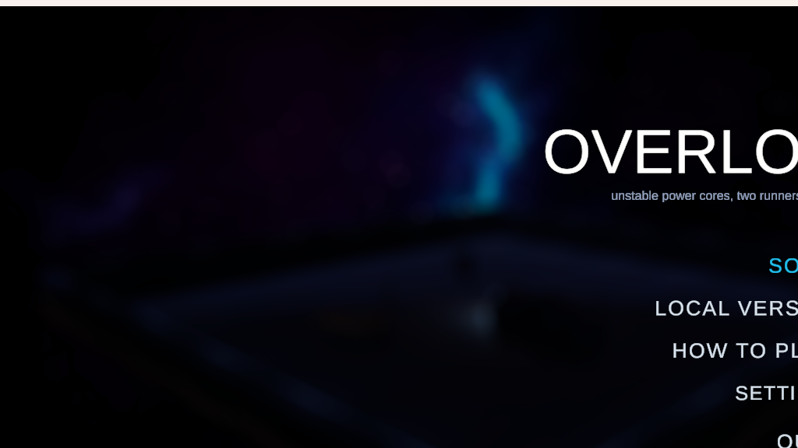
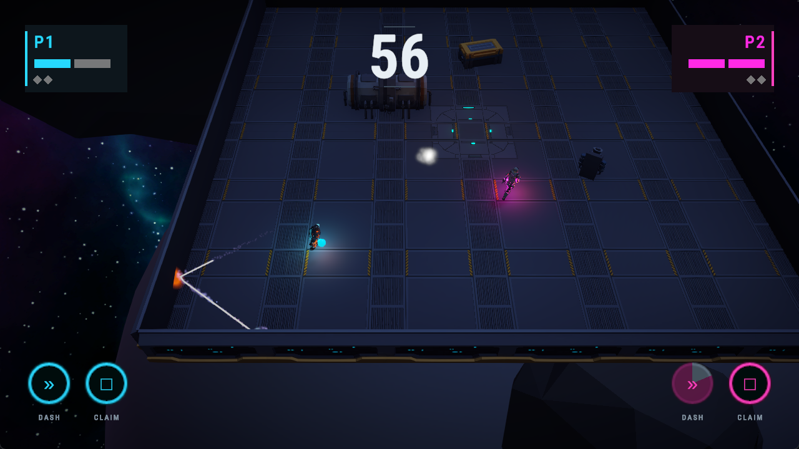
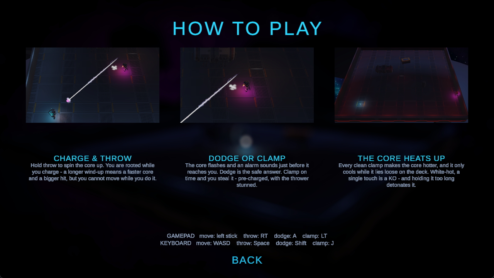
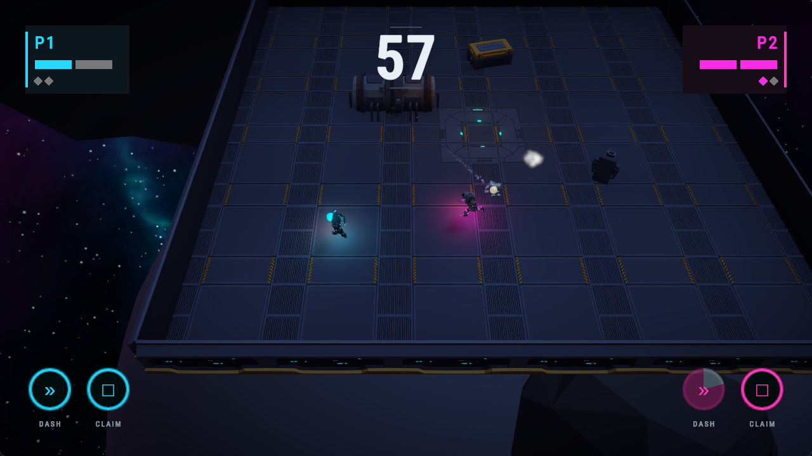
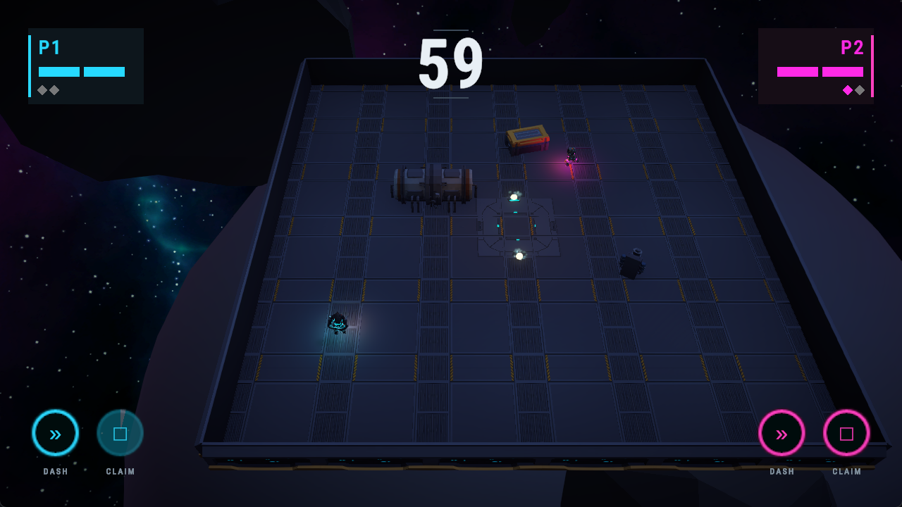
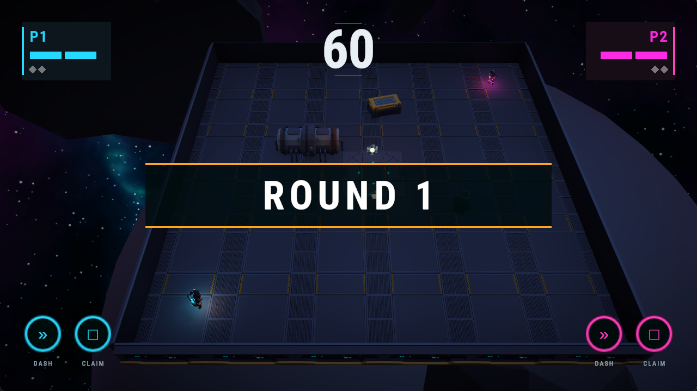
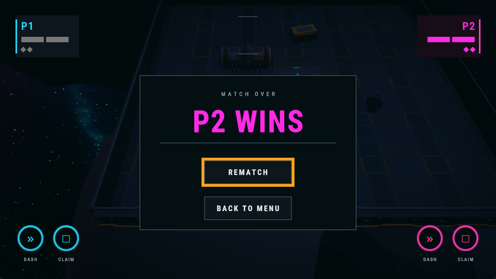
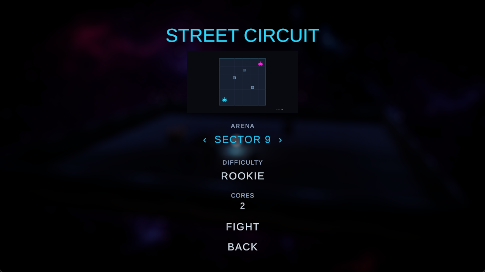
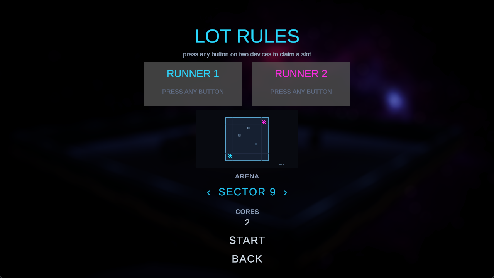

# OVERLOAD

**Unstable power cores, two runners, no health bars.**

A three-day solo game jam build (Club Jam, theme *Knockout City*) made in Unity 6. Two runners share
one arena and a handful of power cores. There is no shooting, no health regen and nowhere to hide —
the only weapon in the room is the thing you are also trying not to get hit by.



## The hook

Every dodgeball game asks one question: *catch or dodge?* OVERLOAD adds a third answer.

- **The core heats up.** Every cleanly timed clamp makes it hotter, and it only cools while it lies
  loose on the deck. Past 80 heat it is **critical** — a single touch is a knockout instead of two.
- **Holding it cooks you.** Possession is a five-second fuse (two while critical), so camping the
  core is not a way to run out the clock. It detonates in your hands.
- **So a late clamp is a real move.** A PERFECT clamp steals the core pre-charged and stuns the
  thrower; a LATE clamp saves your life but drops the core loose at your feet — and starts it
  cooling. Refusing the ball is a legitimate strategy, which is the part no other dodgeball has.

Rounds are 60 seconds, two knocks is a KO, and a match is best of three.



## How it plays



| Action | Gamepad | Keyboard P1 | Keyboard P2 |
|---|---|---|---|
| Move / face | Left stick | WASD | Arrows |
| Charge & throw | RT (hold, release) | Space | Numpad 0 |
| Dash | A / South | Left Shift | Numpad 1 |
| Clamp | LT or B | J | Numpad 2 |

Charging roots you in place: a longer wind-up is a faster core and a bigger hit, but you cannot move
while you hold it. The core flashes and an alarm sounds just before it reaches you — that is the cue
you are reading, and it is the same cue for both answers.

<table>
<tr>
<td></td>
<td></td>
</tr>
<tr>
<td></td>
<td></td>
</tr>
</table>

## Modes

**STREET CIRCUIT** — solo against the house runner, on one of three difficulty tiers: ROOKIE,
OPERATOR, GHOST. One AI, three profiles; a tier is a set of numbers on a ScriptableObject rather
than a separate code path, and the headline number is how often it goes for the clamp.

**LOT RULES** — local versus. Press any button on two devices to claim a slot and the match starts;
a rematch is one button, no menus.

Either mode picks a deck (**SECTOR 9** or **THE SPINE**) and how many cores are in play. One core is
the tuned game — every read is built on there being exactly one thing to watch — and anything above
that is a party mode.




## Running it

**From a build.** `Build/` holds a Windows player and `Builds/WebGL/` a browser build. The web build
needs to be served over HTTP rather than opened from disk:

```bash
python -m http.server 8000 --directory "Builds/WebGL/Club Jam"
```

**From source.** Unity **6000.3.14f1**, URP. Open the project, load
`Assets/_Deadball/Scenes/Menu.unity` and press Play. The arena scenes
(`Arena_Greybox` — SECTOR 9 — and `Arena_TheSpine`) can also be played directly; `MatchSettings.asset`
keeps sensible values so an arena opened on its own still runs.

Tuning lives in `Assets/_Deadball/Data/`: `MatchConfig.asset` is every gameplay number in one place,
`FighterPalette.asset` the cyan/magenta slot colours, and `AI_Rookie/Operator/Ghost.asset` the three
difficulty tiers.

## Tests

51 PlayMode tests cover the loop end to end — grab, charge, root, throw, the clamp tiers, lockout,
dash, knocks, KO, round and match flow, the comeback handicap, heat, the fuse and the solo roster.
They drive real fighters through the real core in the real arena; the only substitution is the input
source.

```bash
unity test "D:/Unity/Zanga/Club Jam" --mode PlayMode
```

## Shape of the code

Everything the jam wrote lives under [`Assets/_Deadball/`](Assets/_Deadball); the rest of `Assets/`
is third-party.

- **The core is the only systemic object.** It talks to fighters through `IBallTarget`, never to
  `Fighter` directly.
- **A fighter is a facade** over four parts that own one rule each — `FighterMotor`,
  `FighterThrower`, `FighterCatcher`, `FighterKnocks` — all driven by an `IFighterInput`. That
  interface is why the AI is a second implementation on the same prefab instead of a second fighter.
- **`IFighterRoster`** is the matching seam for modes: the match director asks a roster for its
  fighters and does not care whether a slot is a human or the house.
- **Cross-system reactions go over an EventBus.** Presentation subscribes and never polls, so the
  rules can be re-tuned without touching the visuals.

## Built with

Synty environment art, MoreMountains TopDownEngine, Heat Complete Modern UI, BroAudio, Odin
Inspector, Cinemachine, TransitionsPlus, Hovl Studio and Plasma FX effects, Graphy, and a Sci-Fi game
sound effects pack.

The design document the build follows is not in this repository.
